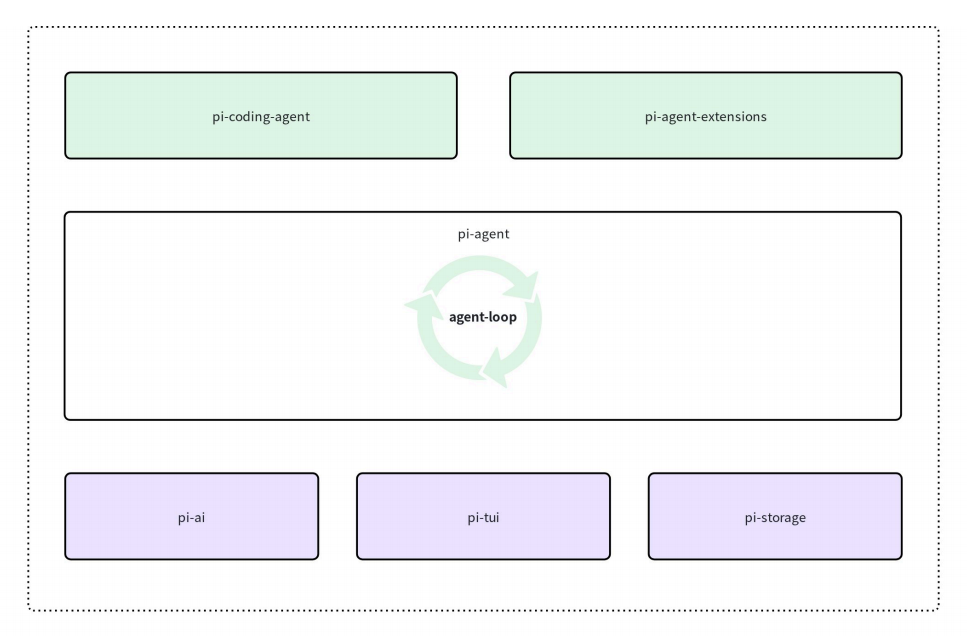
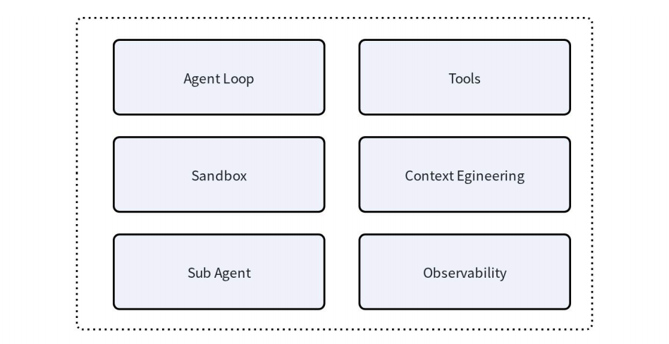
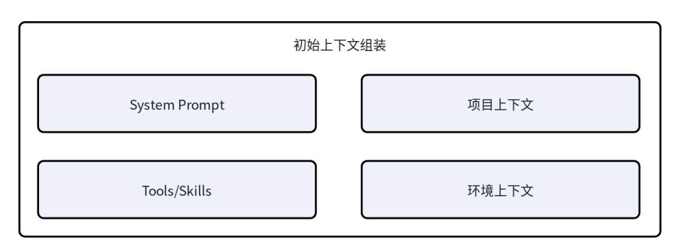
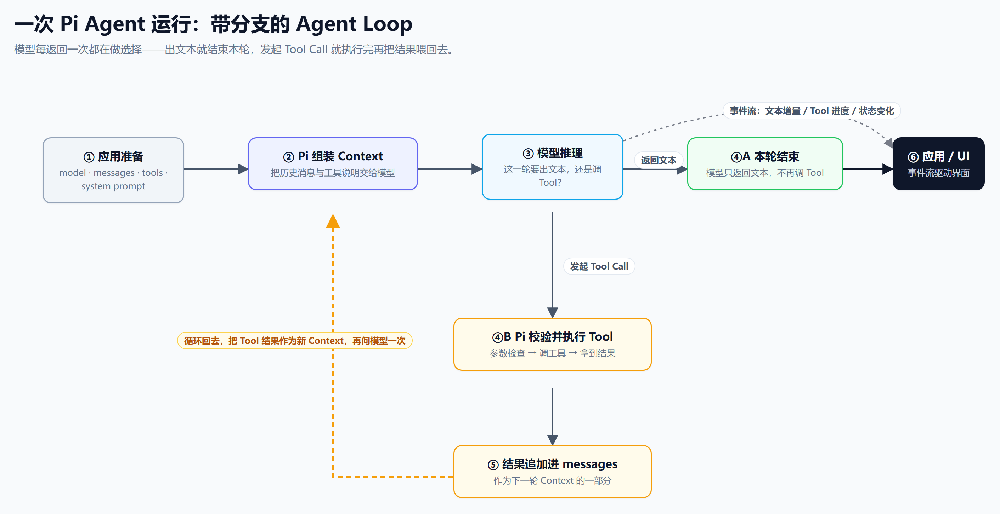

# 00 技术序篇｜Pi Harness 怎样让 Agent 跑起来

大家好，我是居丽叶。

从这篇开始，我会连载一个新系列——《如何基于 Pi 开发自己的 Agent 项目》。总共五篇：

00 **技术序篇**：Pi Harness 怎样让 Agent 跑起来

01 **看懂 Pi**：选对开发层，跑通第一个 Agent

02 **组装 Pi**：Tool、Context 与输出合约

03 **组织 Pi**：Router、Workers 与 Verifier

04 **交付 Pi**：从一次真实请求走到 Trace 与降级

本篇是序篇，会从包结构、一次请求的 body、上下文、Agent Loop 这几个角度，回答一个问题：**Pi 是怎么把一个只能一问一答的大模型，变成一个能读文件、能跑命令、能改代码的 Agent 的？**

先简单交代一下背景。Pi（中文可读作 π：pai）是一个开源 Coding Agent，TypeScript 写的，在 GitHub 上拿了 10 万 Star。它能接市面上几乎所有主流模型，把 Agent 最核心的 Loop 封装成一个最小可运行的 Harness。它也在很多爆火产品中得到了应用，比如 2026 年初的现象级开源 Agent —— OpenClaw，它在底层也是依赖 PI 作为自己的 Agent 核心。

它的设计思想可以概括成两句话：**Coding Agent = Model + Harness**；以及**如无必要，勿增实体**。

模型负责推理，Harness 负责把模型放进一个能行动的环境里。Pi 眼里 Harness 唯一"必要"的事就是让 Agent 能跑起来；至于工具、界面、子 Agent、沙箱，全都留给外面去扩展。

## 一、Pi 的包结构

打开 Pi 的仓库，第一反应是包很多。其实按职责看就六层：

| 包 | 干什么 |
|---|---|
| `pi-ai` | 模型抽象层。抹平各家厂商 API 差异，上层只面对一个 `model` |
| `pi-tui` | 终端 UI。把事件流渲染成你看到的那个交互界面 |
| `pi-storage` | 存储抽象。把会话、历史消息接到底层数据库 |
| `pi-agent` | 核心。Agent Loop 真正跑在这里，生命周期、工具执行、状态更新都在这 |
| `pi-coding-agent` | 组合包。把 tools、context、extensions、sessions 拼成一个能直接用的终端助手 |
| `pi-agent-extensions` | 扩展入口。子 Agent、沙箱、自定义工具都从这里接 |



这套分法的核心思想一句话：**核心只做 Agent 怎么跑，外围负责它能做什么。**

对比一下你就明白它有多克制。一般你以为 Harness 该有的东西——Agent Loop、Tools、Context Engineering、Sandbox、Sub Agent、Observability——Pi 一个都没全塞进核心：



官方原话是"保持最小可用"，需要什么就去配 extension。

代价是开箱即用的"全家桶感"弱一点；好处是你读源码的时候，不用穿过一大堆默认功能，直接能看到 Agent Loop 的骨架。

## 二、请求体的结构

谈 Context Engineering 容易停在概念上。不如直接看：Pi 每次调模型，HTTP body 里到底装了什么。

抓包简化一下，长这样：

```json
{
  "model": "gpt-...",
  "input": [
    {
      "role": "developer",
      "content": "你是 pi 里的 coding 助手。可用工具：read / bash / edit / write。当前目录：/Users/.../pi。已加载的 skill：github-triage、incident-analysis... 当前日期：2026-07-28"
    },
    { "role": "user", "content": "请用 github-triage 分析一个 GitHub issue" },
    { "type": "function_call", "name": "read", "arguments": "{\"path\":\".../SKILL.md\"}" },
    { "type": "function_call_output", "output": "---\nname: github-triage\n..." }
  ],
  "tools": [
    { "name": "read", "description": "...", "parameters": { ... } },
    { "name": "bash", "description": "...", "parameters": { ... } },
    { "name": "edit", "description": "...", "parameters": { ... } },
    { "name": "write", "description": "...", "parameters": { ... } }
  ],
  "stream": true
}
```

真实的包比这个长几十倍（光 `tools` 里每个工具的 schema 就好几屏），但结构就是两块：

- **`input`**：上下文。系统提示词 + 用户消息 + 历史上所有的工具调用和结果。
- **`tools`**：这次允许模型调用哪些函数，每个函数什么参数。

值得一提的是 Pi 的系统提示词特别短。有人做过统计：Codex CLI 的 system prompt 大概 6000 token，Gemini CLI 5000–6000，Claude Code 3000–5000，而 **Pi 默认只有 181 个词左右、约 350 token**。这就是它"小"的地方——不把规则写满，靠 Context 组装按需给。

## 三、Context Engineering

请求体是对话里某一帧的样子。真正考验 Harness 的是：随着对话越滚越长，这份上下文要怎么被一直管下去。

### 3.1 Context 的初始化

每次会话开始，Pi 会拼四块东西进上下文：



1. **System Prompt**：内置的那一小段，也可以在项目根目录放一个 `.pi/SYSTEM.md` 覆盖；
2. **Tools / Skills 清单**：工具或技能有变化时重新算一次，注入可用列表；
3. **项目上下文**：自动从工作目录往上找 `AGENTS.md`（也认 `CLAUDE.md`），把项目约定喂给模型；
4. **环境信息**：当前目录、日期、相关文档路径，帮模型别"找不着北"。

### 3.2 Context 的压缩

对话越滚越长，不压就爆。Pi 的触发条件是：当前上下文 token 数 > 模型窗口 − 预留的 16384 token。压的时候它保留最近 20000 token，把更早的历史交给模型总结成一段 summary，再把 `system prompt + summary + 最近消息` 作为下一轮的输入。

还有一个很贴心的设计：**切分支也会触发压缩**。你在 git 切分支后，Pi 会给模型塞一段"branch summary"，告诉它工作区文件变了什么，免得模型突然发现文件面目全非、以为自己出错了。

### 3.3 工具输出的截断

比上下文膨胀更危险的是工具输出。你让模型跑一个脚本，脚本吐出来两万行日志，不截一下立刻把 Context 撑爆。

Pi 的规则很直接：**行数 + 字节数双限制，谁先到谁生效**。默认所有工具最多 2000 行 / 50KB；read 保留开头（文件头最重要），bash 保留结尾（错误和结果通常在末尾），grep 单行超过 500 字符就截断加 `[truncated]`。

这些细节看起来琐碎，但它们决定了 Agent 跑长任务时会不会"越跑越笨"。

## 四、Agent Loop

最核心的部分来了。Pi 一次完整的 Agent 运行长这样：



顺着图走一遍：应用把 model、messages、tools、system prompt 准备好（①），Pi 组装成 Context 交给模型（②），模型这一轮要么返回文本结束（④A），要么发起一个 Tool Call（④B）——Pi 校验参数、执行工具、把结果追加进 messages（⑤），然后再回到 ② 调一次模型，直到模型只返回文本、不再调工具为止。

这条循环本身不复杂。Pi 在它外面又包了两层东西：

- **steering 消息**：你在 Agent 跑的过程中直接敲字，它不会丢，会在下一轮被接住——模型会"看到"你中途说的话。
- **follow-up 消息**：哪怕这轮 Loop 看起来要结束了，还会再等一拍，看有没有后续任务要接。

对应到事件层级，Pi 把一次运行拆成四层：

| 层级 | 含义 | 起止事件 |
|---|---|---|
| Agent | 一次完整 run，从用户任务到收工 | `agent_start` / `agent_end` |
| Turn | 一次模型回复 + 它触发的所有工具 | `turn_start` / `turn_end` |
| Message | 一条 user / assistant / tool 消息 | `message_start` / `message_update` / `message_end` |
| Tool execution | 工具真正执行的过程 | `tool_execution_start` / `tool_execution_update` / `tool_execution_end` |

这套事件不是给日志看的，是给外面接 UI、接 Trace、接业务系统用的。我们后面做行政 Agent 的网页和追踪面板，消费的就是这一套事件。

## 五、Pi 在文枢里的位置

讲到这里，你应该能看出来 Pi 的设计取舍：

- 模型层、Runtime 层、产品层、界面层分开；
- 核心只跑 Loop，不堆功能；
- Context 该截的截、该压的压；
- 事件流完整开放，外面想接什么接什么。

这正好是我们做行政 Agent「文枢」需要的形状。

文枢不是一个终端工具，它有 Python 后端、MongoDB、权限系统、Web 界面，还有一堆行政业务（制度问答、公文流转、跨部门会签）。整套系统长这样：


中间蓝色那层（L2 · Harness 多智能体协同层）才是 Pi Runtime 真正待的位置——Intent、Rewriter、Retrieval、Answer、Verifier 这些 Agent 都跑在它上面。它外面还有接入层、Loop 自进化层、数据检索层和 K8s 部署层，那些全是我们自己的业务代码，不交给 Pi。

所以我们不需要 Pi 的 TUI，也不需要它那套终端会话体系；我们要的是它下面那层稳定的 Runtime——给我们提供模型接入、Agent Loop、工具执行和事件流，上面长什么业务完全自己决定。

所以这个系列后面四篇，我们做的事就是：把 Pi 从"终端里的编程助手"拆开，取它的 `pi-agent-core + pi-ai` 两层，嵌进自己的产品里。下一篇开始，我们就从一个空目录跑通第一个 Agent。

---

**下一篇预告｜01 看懂 Pi：选对开发层，跑通首个 Agent**

Pi 那一堆包、五个调用入口，到底从哪个下手？我们建一个 `pi-minimal` 目录，装依赖、配模型、写 30 行代码，亲手看到第一句流式回复打在终端上。
