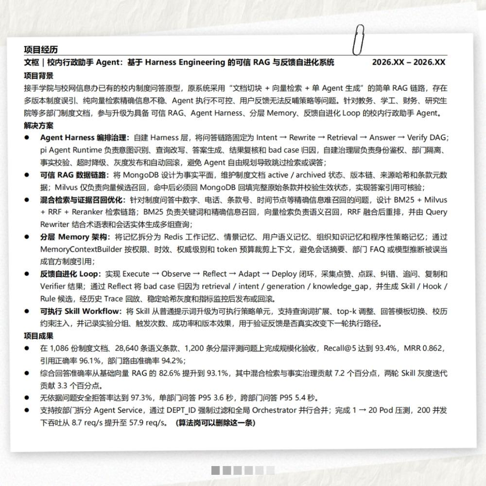

# 用 Pi Agent 开发自己的 Multi-Agent 系统

系列共一篇序篇 + 四篇正文。

## 目录

| 篇目 | 主题 | 正文 | 代码 |
|---|---|---|---|
| 00 | 技术序篇：Pi Harness 怎样让 Agent 跑起来 | [阅读正文](00_序篇/00%20序篇｜Pi%20Harness%20怎样让%20Agent%20跑起来.pdf) | 无（概念篇） |
| 01 | 看懂 Pi：选对开发层，跑通第一个 Agent | [阅读正文](01_看懂Pi/article.md) | [pi-minimal](01_看懂Pi/code/pi-minimal/README.md) |
| 02 | 组装 Pi：Tool、Context 与输出合约 | [查看进度](02_组装Pi/README.md) | 待补 |
| 03 | 组织 Pi：Router、Workers 与 Verifier | [查看进度](03_组织Pi/README.md) | 待补 |
| 04 | 交付 Pi：从一次真实请求走到 Trace 与降级 | [查看进度](04_交付Pi/README.md) | 待补 |

知识库链接：[飞书知识库](https://my.feishu.cn/wiki/UgRJwgfzhinKIUkjgH1ck6zTnYg?from=from_copylink)

如果你想找一个已经实现好的、可以直接写在简历上的、基于pi agent开发的自进化multi-agent项目，可以用我这个：

项目的详细介绍见：[微信公众号文章](https://mp.weixin.qq.com/s/1qmJ5PiShtf48fhM3LaGow)
